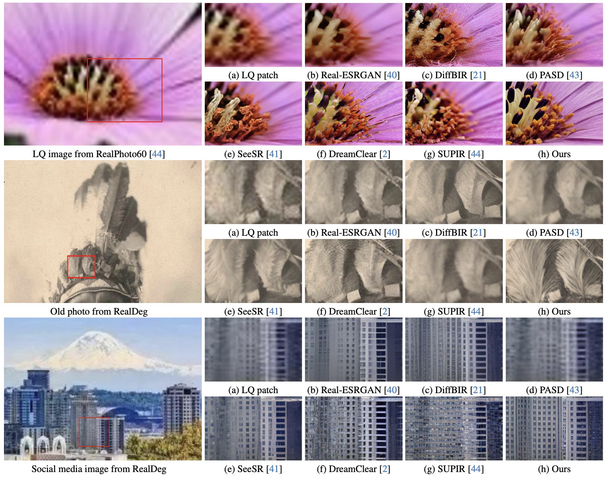

### (CVPR 2025) FaithDiff: Unleashing Diffusion Priors for Faithful Image Super-resolution 
[](https://huggingface.co/jychen9811/FaithDiff)

> [[Project Page](https://jychen9811.github.io/FaithDiff_page/)]  &emsp; [[Paper](https://arxiv.org/abs/2411.18824)]

> [Junyang Chen](https://jychen9811.github.io/), [Jinshan Pan](https://jspan.github.io/), [Jiangxin Dong](https://scholar.google.com/citations?user=ruebFVEAAAAJ&hl=zh-CN&oi=ao) <br>
> [IMAG Lab](https://imag-njust.net/), Nanjing University of Science and Technology

> If FaithDiff is helpful for you, please help star the GitHub Repo. Thanks! 
---

### 🚩 **New Features/Updates**
- ✅ April 3, 2025. The code has been integrated into [Diffusers](https://github.com/huggingface/diffusers/blob/main/examples/community/pipeline_faithdiff_stable_diffusion_xl.py). Respect to Eliseu Silva!!!
- ✅ April 1, 2025. Supports FP8 inference and CPU offloading, significantly reducing memory usage. Thanks Eliseu Silva!!!
- ✅ March 28, 2025. Update a nice gradio demo.
- ✅ March 24, 2025. Release the training code.
- ✅ February 09, 2025. Support ultra-high-resolution (8K and above) image restoration on 24GB GPUs.
- ✅ February 08, 2025. Release [RealDeg](https://drive.google.com/file/d/1B8BaaMjXJ-1TfcTgE9MrAg8ufvaGkndP/view?usp=sharing). It includes 238 images with unknown degradations, consisting of old photographs, social media images, and classic film stills.
- ✅ February 07, 2025. Release the testing code and [pre-trained model](https://huggingface.co/jychen9811/FaithDiff).
- ✅ November 25, 2024. Creat the repository and the [project page](https://jychen9811.github.io/FaithDiff_page/).

### ⚡ **To do**
- FaithDiff-SD3-Large
- ~~Release the training code~~
- ~~Release the testing code and pre-trained model~~

---

### 📷 Real-World Enhancement Results
[](https://imgsli.com/MzQ3NDQx) [](https://imgsli.com/MzQ3NDM5)
[](https://imgsli.com/MzQ3NDYx) [](https://imgsli.com/MzQ3NDU2)

<!--  -->

---

### 🌈 AIGC Enhancement Results
[](https://imgsli.com/MzQ3NjEz)
[](https://imgsli.com/MzQ3NjAx)
[](https://imgsli.com/MzQ3NTk0)
[](https://imgsli.com/MzQ3NTk2)
[](https://imgsli.com/MzQ3NjA0)
[](https://imgsli.com/MzQ3NjA2)
[](https://imgsli.com/MzQ3NjE1)
[](https://imgsli.com/MzQ3NjA5)
[](https://imgsli.com/MzQ3NjEw)

---

### :gift: Gradio Demo
```
python gradio_demo.py

#### Additional parameters
You can add the following parameters to the gradio application.
```Shell
--cpu_offload = Offloads the weights of the pipeline components to the CPU RAM. If you have a GPU with less than 12GB it would be a good idea to use this parameter.
--use_fp8 = Changes the diffusion model precision from FP16 to FP8, significantly reducing GPU memory requirements. This option in conjunction with **--cpu_offload** will require only 5GB VRAM for a 2x upscale.

# FP8 Inference and CPU offloading
python gradio_demo.py --cpu_offload --use_fp8
# FP8 Inference, CPU offloading and without LLaVA
python gradio_demo.py --cpu_offload --use_fp8 --no_llava
```


---
### ⚡ How to train

#### Environment
```
conda env create --name faithdiff -f environment.yml
```

#### Training Script
```Shell
# Stage 1
bash train_stage_1.sh

# After Stage 1 training, enter the checkpoints folder.
cd ./train_FaithDiff_stage_1_offline/checkpoint-6000
python zero_to_fp32.py ./ ./pretrain.bin

# Stage 2
bash train_stage_2.sh

# After Stage 2 training, enter the checkpoints folder.
cd ./train_FaithDiff_stage_2_offline/checkpoint
python zero_to_fp32.py ./ ./FaithDiff.bin
```

#### Tips for Human Face data preparation
- *To quickly filter out low-quality data in the FFHQ dataset, we recommend using topiq to assess image quality. Here are the [official results](https://github.com/chaofengc/IQA-PyTorch/blob/a7f2be4363f3a4c765c6868239336f6eeba33c93/tests/FFHQ_score_topiq_nr-face.csv). We empirically selected images with a metric above 0.72.*
- *During training, we recommend resizing the face image resolution to a range between 768 and 512.*
- *If you need to improve the restoration performance of portrait images, [Unsplash](https://unsplash.com/) offers high-quality portrait images. You can search for different clothing names to obtain full-body portrait data.*
---


### 🚀 How to evaluate

#### Download Dependent Models
- [FaithDiff Pre-trained model](https://huggingface.co/jychen9811/FaithDiff)
- [SDXL RealVisXL_V4.0](https://huggingface.co/SG161222/RealVisXL_V4.0)
- [SDXL VAE FP16](https://huggingface.co/madebyollin/sdxl-vae-fp16-fix)
- [LLaVA CLIP](https://huggingface.co/openai/clip-vit-large-patch14-336)
- [LLaVA v1.5 13B](https://huggingface.co/liuhaotian/llava-v1.5-13b)
- [BSRNet](https://drive.usercontent.google.com/download?id=1JGJLiENPkOqi39bvQYa_jlIPlMk24iKH&export=download&authuser=0&confirm=t&uuid=ebaa5d11-ac76-4f54-aabf-90fa43997dec&at=AEz70l4zk_8LTafpGtR0ZSE50F1N:1742369984793)
- Put them in the `./checkpoints` folder and update the corresponding path in CKPT_path.py.

#### Val Dataset
RealDeg: [Google Drive](https://drive.google.com/file/d/1B8BaaMjXJ-1TfcTgE9MrAg8ufvaGkndP/view?usp=sharing)

*To evaluate the performance of our method in real-world scenarios, we collect a dataset of 238 images with unknown degradations, consisting of old photographs, social media images, and classic film stills. The category of old photographs includes black-and-white images, faded photographs, and colorized versions. Social media images are uploaded by us to various social media platforms (e.g., WeChat, RedNote, Sina Weibo and Zhihu), undergoing one or multiple rounds of cross-platform processing. The classic film stills are selected from iconic films spanning the 1980s to 2000s, such as The Shawshank Redemption, Harry Potter, and Spider-Man, etc. The images feature diverse content, including people, buildings, animals, and various natural elements. In addition, the shortest side of the image resolution is at least 720 pixels.*

#### Inference Script
```Shell
# Script that support two GPUs. 
CUDA_VISIBLE_DEVICES=0,1 python test.py --img_dir='./dataset/RealDeg' --save_dir=./save/RealDeg --upscale=2 --guidance_scale=5 --num_inference_steps=20 --load_8bit_llava 

# Scripts that support only one GPU.
CUDA_VISIBLE_DEVICES=0 python test_generate_caption.py --img_dir='./dataset/RealDeg' --save_dir=./save/RealDeg_caption --load_8bit_llava
CUDA_VISIBLE_DEVICES=0 python test_wo_llava.py --img_dir='./dataset/RealDeg' --json_dir=./save/RealDeg_caption --save_dir=./save/RealDeg --upscale=2 --guidance_scale=5 --num_inference_steps=20

# If attempting ultra-high-resolution image restoration, add --use_tile_vae in the scripts. The same applies to test_wo_llava.
CUDA_VISIBLE_DEVICES=0,1 python test.py --img_dir='./dataset/RealDeg' --save_dir=./save/RealDeg --use_tile_vae --upscale=8 --guidance_scale=5 --num_inference_steps=20 --load_8bit_llava 
```


---


### BibTeX
    @inproceedings{chen2024faithdiff,
    title={FaithDiff: Unleashing Diffusion Priors for Faithful Image Super-resolution},
    author={Chen, Junyang and Pan, Jinshan and Dong, Jiangxin},
    booktitle={CVPR},
    year={2025}
    }
---

### Contact
If you have any questions, please feel free to reach me out at `jychen9811@gmail.com`.

---

### Acknowledgments
Our project is based on [diffusers](https://github.com/huggingface/diffusers/tree/main), [SUPIR](https://github.com/Fanghua-Yu/SUPIR), [TLC](https://github.com/megvii-research/TLC) and [SimpleTuner](https://github.com/bghira/SimpleTuner/tree/main). Thanks for their awesome works.

